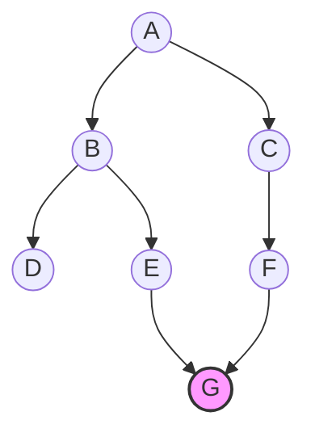
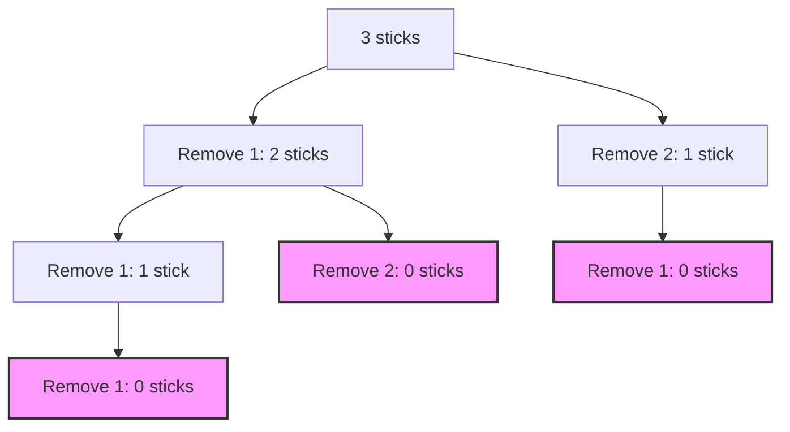
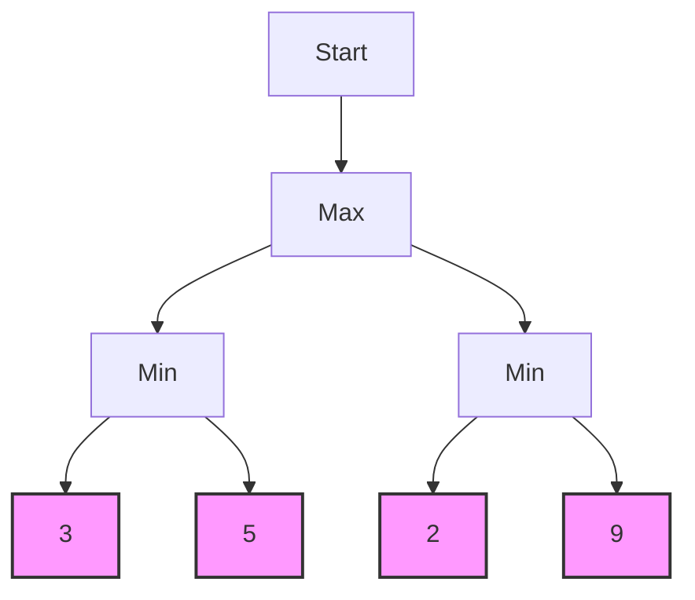

# Searching Techniques in Artificial Intelligence

---

## Introduction to Searching Techniques

- Searching techniques are methods used to find solutions to problems by exploring different possibilities. In Artificial Intelligence (AI), searching helps computers solve puzzles, play games, and make decisions by looking for the best way to reach a goal.
- Problem solving by searching means breaking a problem into smaller steps and checking each step to see if it leads to the solution.
- Searching for solutions is like finding a path from a starting point to a goal, checking different routes until the best one is found.

---

## Problem Solving by Searching

- In AI, many problems can be solved by searching through possible states or actions. The computer starts at an initial state and explores different paths to reach the goal state.
- Each step or move leads to a new state. The process continues until the goal is found or all possibilities are checked.
- Examples include solving puzzles, finding routes on a map, or playing games like chess.

---

## Searching for Solutions

- The process of searching for solutions involves:
  1. Defining the problem and goal.
  2. Listing possible actions or moves.
  3. Exploring different paths using a search algorithm.
  4. Checking if the goal is reached.
  5. Choosing the best solution found.
- Search algorithms help computers make decisions and find answers efficiently.

---

## Uninformed vs Informed Search & Heuristics

**PYQ Compare uninformed and informed search methods (2023, Section A)**

- **Uninformed Search (Blind Search):**

  - Does not use any extra information about the problem except the start and goal states.
  - Examples: Breadth-First Search (BFS), Depth-First Search (DFS).
  - Explores all possible paths equally, which can be slow and use lots of memory.

- **Informed Search (Heuristic Search):**
  - Uses extra information (heuristics) to guess which path is better.
  - Examples: Best-First Search, A\* Algorithm.
  - Faster and more efficient because it focuses on promising paths.

| Point               | Uninformed Search            | Informed Search                     |
| ------------------- | ---------------------------- | ----------------------------------- |
| 1. Knowledge Used   | No extra info (blind)        | Uses heuristics                     |
| 2. Examples         | BFS, DFS, Uniform Cost       | Best-First, A\*, Greedy             |
| 3. Efficiency       | Less efficient               | More efficient                      |
| 4. Memory Usage     | Can be high                  | Usually lower                       |
| 5. Path Explored    | All paths equally            | Promising paths first               |
| 6. Goal Detection   | May take longer              | Reaches goal faster                 |
| 7. Optimality       | BFS/Uniform Cost are optimal | A\* is optimal if heuristic is good |
| 8. Implementation   | Simple                       | More complex                        |
| 9. Domain Knowledge | Not required                 | Required                            |
| 10. Use Case        | Small/simple problems        | Large/complex problems              |

**PYQ Give the heuristic function for shortest path problem (2019, Section A)**

- **Heuristic Function:**
  - A heuristic is a simple rule or guess that helps a computer decide which step to take next when solving a problem.
  - It does not always give the exact answer, but it helps find the solution faster by pointing in the right direction.
  - For shortest path problems, a common heuristic is the straight-line distance (also called "as the crow flies") from where you are now to where you want to go.
  - **Example:** Imagine you are trying to find the shortest way from your house to your school on a map. The straight-line distance between your house and school is a good heuristic—it tells you how close you are, even if you can't walk in a straight line.
  - Computers use this idea to choose which path to try next. If one path gets you closer to the goal (school), the computer will try that path first.
  - Heuristics make searching faster and help computers solve puzzles, find routes, and play games more efficiently.

**PYQ Discuss water jug problem with heuristic search techniques (2024, Section C)**

- **Water Jug Problem (Heuristic Search):**

  - The water jug problem asks you to measure a certain amount of water using two jugs with different capacities, like a 4-liter jug and a 3-liter jug.
  - Heuristic search helps solve this by estimating how close each step is to the goal. For example, the heuristic could be the difference between the current amount of water and the target amount.
  - At each step, the algorithm chooses actions (like filling, emptying, or pouring water between jugs) that bring you closer to the target amount.
  - This reduces unnecessary moves and helps find the solution faster than just trying every possible step.
  - Heuristic search is useful for problems like this because it guides the search toward the goal efficiently.

**PYQ Explain the A\* Algorithm with steps till goal state (2022, Section C)**

**A\* Algorithm: Complete Explanation with Steps and Example**

- **What is A\* Algorithm?**

  - A\* (A-star) is an informed search algorithm used to find the shortest path from a start state to a goal state in a graph or grid.
  - It combines the actual cost to reach a node (`g(n)`) and an estimated cost from that node to the goal (`h(n)`, called the heuristic).
  - The total cost function is: $f(n) = g(n) + h(n)$.
  - A\* is optimal and complete if the heuristic is admissible (never overestimates the true cost).

- **Steps of A\* Algorithm:**

  1. Initialize the open list (nodes to be evaluated) and closed list (nodes already evaluated).
  2. Add the start node to the open list.
  3. While the open list is not empty:
     - a. Pick the node with the lowest $f(n)$ from the open list.
     - b. If this node is the goal, stop and reconstruct the path.
     - c. Otherwise, move it to the closed list.
     - d. For each neighbor of this node:
       - i. If neighbor is in closed list, skip it.
       - ii. If neighbor is not in open list, add it and calculate $f(n)$.
       - iii. If neighbor is in open list with higher $f(n)$, update its cost and parent.

- **Example:**

  - Suppose you want to find the shortest path from A to D in the following graph:

    ```
    A --1-- B --1-- D
     \     |
      4    2
       \   |
         C
    ```

    - Costs: A-B=1, B-D=1, A-C=4, B-C=2
    - Heuristic (straight-line to D): h(A)=2, h(B)=1, h(C)=3, h(D)=0

  - **Step-by-step:**
    1. Start at A. $g(A)=0$, $h(A)=2$, $f(A)=2$
    2. Expand A: neighbors are B and C.
       - B: $g(B)=1$, $h(B)=1$, $f(B)=2$
       - C: $g(C)=4$, $h(C)=3$, $f(C)=7$
    3. Choose B (lowest $f$).
    4. Expand B: neighbors are D and C.
       - D: $g(D)=2$, $h(D)=0$, $f(D)=2$
       - C: $g(C)=3$, $h(C)=3$, $f(C)=6$ (update C since $g(C)$ is lower)
    5. Choose D (lowest $f$). D is the goal.
    6. Path found: A → B → D with total cost 2.

- **Summary:**
  - A\* efficiently finds the shortest path using both actual and estimated costs.
  - It is widely used in pathfinding (e.g., maps, games, robotics).

---

## General Search Algorithms & Strategies

**PYQ Implement the Search Algorithms in LISP/C. Comment suitability (2019, Section C)**

- **LISP for Search Algorithms:**

  - LISP is a programming language often used in AI because it works well with lists and symbolic data.
  - Search algorithms like BFS and DFS can be written in LISP using recursion and list operations.
  - Example: In LISP, you can represent a graph as a list of nodes and edges, and use functions to explore paths.
  - LISP is suitable for AI because it makes it easy to manipulate data structures and try different possibilities.

- **C for Search Algorithms:**

  - C is a fast and efficient language, good for handling large problems and data.
  - Search algorithms in C use arrays, pointers, and loops to explore paths.
  - Example: You can use queues for BFS and stacks for DFS in C, and manage memory directly.
  - C is suitable for search algorithms when speed and control over memory are important, like in games or robotics.

- **Suitability:**
  - LISP is best for symbolic AI problems and quick prototyping.
  - C is best for performance and handling big data or real-time systems.
  - Both can implement search algorithms, but LISP is easier for experimenting, while C is better for production and speed.

---

**PYQ Discuss use of PROLOG for search algorithms (2019, Section C)**

- **Search Algorithms in PROLOG:**

  - PROLOG is a logic programming language widely used in AI for implementing search algorithms, especially those based on logical inference and rule-based reasoning.
  - Search in PROLOG is performed by defining facts and rules, and letting the PROLOG engine automatically explore possible solutions using backtracking.
  - Common search strategies like depth-first search (DFS) are built into PROLOG's execution model, as it tries rules one by one and backtracks when needed.

- **How PROLOG Handles Search:**

  - Problems are described using predicates (facts and rules).
  - When a query is made, PROLOG searches for solutions by matching facts and applying rules recursively.
  - The built-in backtracking mechanism allows PROLOG to explore alternative paths if the current path fails.

- **Example Uses:**

  - **Pathfinding:** Define connections between nodes and rules for reaching a destination. PROLOG finds all possible paths or the shortest path using recursive rules.
  - **Puzzle Solving:** Problems like the water jug, missionaries and cannibals, or Sudoku can be encoded as rules and constraints. PROLOG searches for valid solutions.
  - **Expert Systems:** PROLOG can search through a knowledge base of rules to infer conclusions or diagnoses.
  - **Constraint Satisfaction:** PROLOG is effective for problems where solutions must satisfy multiple constraints, such as scheduling or resource allocation.

- **Suitability:**
  - **Advantages:**
    - Easy to express complex relationships and constraints.
    - Automatic search and backtracking simplify coding search problems.
    - Good for symbolic reasoning, logic puzzles, and rule-based AI.
    - Supports recursive definitions, making it natural for search algorithms.
  - **Limitations:**
    - Not ideal for problems requiring high performance or manipulation of large, complex data structures.
    - Less efficient for numerical or graph-based algorithms compared to procedural languages.

---

**PYQ Discuss branch bound search algo (2018, Section A)**

- **Branch and Bound Algorithm:**

  - Branch and Bound is a general algorithmic technique for finding optimal solutions to combinatorial and optimization problems, such as shortest path, traveling salesman, or minimum cost problems.
  - It systematically explores branches of a solution space tree, but "bounds" (prunes) branches that cannot yield a better solution than the best found so far.

- **Key Concepts:**

  - **Branching:** Divide the problem into smaller subproblems (branches) by making choices at each step.
  - **Bounding:** Calculate an upper or lower bound on the best possible solution within a branch. If the bound is worse than the current best solution, discard (prune) that branch.
  - **Pruning:** Eliminate branches that cannot improve the current best solution, reducing the search space and improving efficiency.

- **Steps of Branch and Bound:**

  1. **Initialization:** Start with the initial problem and set the best solution found so far (often infinity for minimization).
  2. **Branching:** At each node, generate child nodes representing subproblems.
  3. **Bounding:** For each child node, compute a bound (e.g., minimum possible cost).
  4. **Pruning:** If a node's bound is worse than the best solution found, discard it.
  5. **Selection:** Continue exploring nodes with promising bounds.
  6. **Termination:** When all nodes are explored or pruned, the best solution found is optimal.

- **Example:**

  - **Shortest Path Problem:** At each step, calculate the minimum possible cost to reach the goal from the current node. If the cost exceeds the best known path, prune that branch.
  - **Traveling Salesman Problem (TSP):** Use branch and bound to eliminate tours that cannot beat the current shortest tour.

- **Advantages:**

  - Guarantees finding the optimal solution.
  - Efficiently reduces the number of possibilities by pruning.

- **Limitations:**

  - May still be slow for very large problems if bounds are not tight.
  - Requires good bounding functions for effective pruning.

- **Applications:**
  - Solving puzzles, scheduling, resource allocation, pathfinding, and other optimization problems.

**PYQ Discuss constraint satisfaction search strategy via DFS, BFS, Best-first (2019, Section C)**

## Constraint Satisfaction Search Strategies

Constraint satisfaction problems (CSPs) are problems where you must find a solution that meets a set of rules or constraints. Examples include Sudoku, map coloring, scheduling, and puzzles. Each variable in the problem must be assigned a value so that all constraints are satisfied.

### 1. Definition of Constraint Satisfaction Problem (CSP)

- A CSP consists of:
  - **Variables:** Items to assign values to (e.g., cells in Sudoku).
  - **Domains:** Possible values for each variable (e.g., numbers 1–9).
  - **Constraints:** Rules that restrict which combinations of values are allowed (e.g., no repeated numbers in a row).

### 2. Search Strategies for CSPs

#### a. Depth-First Search (DFS)

- **How it works:** DFS explores one possible assignment deeply before trying alternatives.
- **Steps:**
  1. Assign a value to the first variable.
  2. Move to the next variable and assign a value.
  3. Continue until all variables are assigned or a conflict occurs.
  4. If a conflict is found, backtrack to the previous variable and try a different value.
- **Advantages:** Uses less memory, can quickly find a solution if the correct path is chosen early.
- **Disadvantages:** May get stuck in dead ends and need to backtrack a lot.

#### b. Breadth-First Search (BFS)

- **How it works:** BFS explores all possible assignments at one level before moving to the next.
- **Steps:**
  1. Start with all possible assignments for the first variable.
  2. For each assignment, try all possible values for the next variable.
  3. Continue level by level, building a tree of possibilities.
  4. Check constraints at each step and discard invalid assignments.
- **Advantages:** Finds the shortest solution path, guarantees finding a solution if one exists.
- **Disadvantages:** Uses more memory, can be slow for large problems.

#### c. Best-First Search (Heuristic Search)

- **How it works:** Uses heuristics to choose the most promising assignments first.
- **Steps:**
  1. Assign values based on a heuristic (e.g., least-constraining value, most-constrained variable).
  2. At each step, pick the assignment that seems most likely to lead to a solution.
  3. Continue until all variables are assigned and constraints are satisfied.
- **Advantages:** Faster and more efficient, especially for large or complex CSPs.
- **Disadvantages:** Depends on the quality of the heuristic; may not always find the optimal solution.

### 3. Example: Sudoku as a CSP

- **Variables:** Each cell in the grid.
- **Domain:** Numbers 1–9.
- **Constraints:** No repeated numbers in any row, column, or box.
- **DFS:** Try filling cells one by one, backtracking if a rule is broken.
- **BFS:** Try all possible numbers for each cell level by level.
- **Best-First:** Fill the cell with the fewest possible options first.

### 4. Summary Table

| Strategy   | How It Works                | Memory Use | Speed  | Suitable For          |
| ---------- | --------------------------- | ---------- | ------ | --------------------- |
| DFS        | Deep exploration, backtrack | Low        | Medium | Small/medium CSPs     |
| BFS        | Level-by-level exploration  | High       | Slow   | Finding shortest path |
| Best-First | Heuristic-guided search     | Medium     | Fast   | Large/complex CSPs    |

**PYQ Explain Best-first search algorithm with diagram (2023, Section B)**

## Best-First Search Algorithm

- **Definition:**  
   Best-First Search is an informed search algorithm that uses a heuristic to select the most promising node to expand next. It always chooses the node that appears closest to the goal based on the heuristic value.

### Key Points

- **Heuristic-Based:**  
   Uses a heuristic function to estimate how close each node is to the goal.
- **Priority Queue:**  
   Maintains a priority queue (often a min-heap) of nodes, ordered by their heuristic values.
- **Exploration:**  
   At each step, expands the node with the lowest heuristic value (i.e., the "best" node).
- **Greedy Nature:**  
   May not always find the optimal path, as it focuses on immediate promise rather than total cost.

### Steps of Best-First Search

1. **Initialize:**  
   Add the start node to the priority queue.
2. **Loop:**  
    While the queue is not empty:
   - Remove the node with the lowest heuristic value.
   - If it is the goal, stop and return the path.
   - Otherwise, expand the node and add its neighbors to the queue (if not already visited).
3. **Repeat:**  
   Continue until the goal is found or all nodes are explored.

### Example

Suppose you want to find a path from node A to node G in the following graph:

```
                A
             / \
            B   C
         / \   \
        D   E   F
                 \   \
                    G   G
```

- Heuristic values (h) estimate distance to G:
  - h(A)=5, h(B)=4, h(C)=3, h(D)=6, h(E)=2, h(F)=1, h(G)=0

**Step-by-step:**

- Start at A (h=5), expand C (h=3), then F (h=1), then G (h=0).
- The algorithm always picks the node with the lowest h value.

### Diagram



_In the diagram, Best-First Search expands nodes in order of lowest heuristic value, quickly reaching the goal (G)._

### Advantages

- Fast for problems where a good heuristic is available.
- Simple to implement.

### Limitations

- May not find the shortest or optimal path.
- Depends heavily on the quality of the heuristic.

---

## Uniformed Searching Techniques

- Uniformed (Uninformed) searching techniques do not use any domain-specific knowledge. They only use information available in the problem definition.
- **Breadth-First Search (BFS):** Explores all nodes at the current depth before moving to the next level. Guarantees the shortest path in an unweighted graph.
- **Depth-First Search (DFS):** Explores as far as possible along each branch before backtracking. Uses less memory but may not find the shortest path.
- **Uniform Cost Search:** Expands the node with the lowest path cost. Useful when costs vary between steps.

---

## Informed Searching Techniques

- Informed searching techniques use heuristics to guide the search toward the goal more efficiently.
- **Best-First Search:** Uses a heuristic to select the most promising node to expand next.
- **A\* Search:** Combines the cost to reach a node and the estimated cost to the goal. Finds the optimal path efficiently.
- **Greedy Search:** Chooses the node that appears to be closest to the goal, but may not find the best solution.

---

## Local Search Algorithms (Hill Climbing)

**What do you infer from hill-climbing search algorithm? (2019, Section A)**
**Differentiate between simple hill climbing and steepest ascent hill climbing (2022, Section A)**

- **Local Search Algorithms:**

  - Local search algorithms are used to find solutions by moving from one possible answer to a better one, step by step, until no better answer is found nearby.
  - They do not keep track of the whole search space, only the current state and its neighbors. This makes them fast and memory-efficient.
  - Used for problems where the solution can be improved gradually, like puzzle solving or optimization.

## Hill Climbing:**

  - Hill climbing is a local search algorithm that starts with an initial solution and repeatedly moves to a better neighboring solution.
  - The process continues until no better neighbor is found (local maximum).
  - **Simple Hill Climbing:** Checks neighbors one by one and moves to the first better solution found.
  
  - **Steepest Ascent Hill Climbing:** Looks at all neighbors and moves to the best one among them.
  - **Problems with Hill Climbing:**

    - Can get stuck at local maxima (not the best overall solution).
    - May get stuck on plateaus (flat areas with no improvement).
    - Can get stuck in ridges (narrow paths that are hard to climb).

### Simple Hill Climbing Explained**

Simple hill climbing is a basic local search algorithm used to solve optimization problems. Here’s how it works, step by step:

#### 1. **Start with an Initial Solution**

- Pick any starting point (solution) in your problem space.

#### 2. **Look at Neighboring Solutions**

- Check the solutions that are directly connected to your current solution (these are called "neighbors").

#### 3. **Choose a Better Neighbor**

- If you find a neighbor that is better than your current solution, move to that neighbor.

#### 4. **Repeat**

- Keep repeating steps 2 and 3: look for a better neighbor and move to it.

#### 5. **Stop When Stuck**

- If none of the neighbors are better than your current solution, stop. You have reached a "peak" (local maximum).

---

#### **Key Points**

- **Only Looks One Step Ahead:** Simple hill climbing only checks immediate neighbors, not the whole search space.
- **No Backtracking:** If it gets stuck at a peak, it does not go back or try other paths.
- **Fast and Memory-Efficient:** It only needs to remember the current solution and its neighbors.
- **May Miss Best Solution:** Sometimes, it stops at a local maximum, which is not the best possible solution (global maximum).

---

#### **Analogy**

Imagine you are climbing a hill in fog. You can only see a few steps ahead. You always step to the highest nearby point. When you can't find a higher spot, you stop—even if there is a taller hill somewhere else you can't see.

---

#### **Example**

Suppose you want to find the highest point in a landscape:

1. Start at a random spot.
2. Look around you—if you see a higher spot, walk there.
3. Repeat until no higher spot is nearby.
4. You stop, but you might not be at the highest point in the whole landscape.

---

### **Summary Table**

| Step            | What Happens                     |
| --------------- | -------------------------------- |
| Start           | Pick a starting solution         |
| Check neighbors | Look for better nearby solutions |
| Move            | Go to a better neighbor          |
| Repeat          | Keep moving to better neighbors  |
| Stop            | No better neighbor found         |

---

**PYQ Diff between Local Search and Global Search (2018, Section A)**

| Point               | Local Search                         | Global Search                               |
| ------------------- | ------------------------------------ | ------------------------------------------- |
| 1. Search Scope     | Explores neighboring solutions only  | Explores entire solution space              |
| 2. Memory Usage     | Low (stores current state only)      | High (may store many states/paths)          |
| 3. Speed            | Fast for small/local improvements    | Slower due to exhaustive exploration        |
| 4. Optimality       | May get stuck at local optima        | Can find global optimum                     |
| 5. Backtracking     | Usually does not backtrack           | Can backtrack and revisit states            |
| 6. Examples         | Hill climbing, simulated annealing   | BFS, DFS, A\*, branch and bound             |
| 7. Use Case         | Suitable for large, complex problems | Suitable for small or well-defined problems |
| 8. Solution Quality | May miss best overall solution       | More likely to find best solution           |
| 9. Heuristic Use    | Relies heavily on heuristics         | May use heuristics or exhaustive search     |

_Local search is quick and memory-efficient but can miss the best answer. Global search is thorough and finds optimal solutions but is slower and uses more resources._

- **Difference between Local and Global Search:**
  - Local search only looks at nearby solutions and may miss the best overall answer.
  - Global search explores the entire search space to find the best possible solution.

### **Steepest-Ascent Hill Climbing Algorithm Explained**

**PYQ Explain Steepest-ascent climbing algo... and discuss problems with it (2018, Section B)**

Steepest-ascent hill climbing is a local search algorithm used for optimization problems. It works by always choosing the neighbor with the highest value (or lowest cost, depending on the problem) at each step.

### How It Works

1. **Start with an initial solution (state).**
2. **Generate all neighboring solutions.**
3. **Evaluate each neighbor using a heuristic (evaluation function).**
4. **Move to the neighbor with the best score (the "steepest ascent").**
5. **Repeat steps 2–4 until no neighbor is better than the current state.**

This process is like climbing a hill: at each step, you look around and move to the highest nearby point.

### Example

Suppose you want to maximize a function $f(x)$:

- Start at $x_0$.
- Check $f(x_0 + 1)$ and $f(x_0 - 1)$.
- Move to the $x$ with the highest $f(x)$.
- Repeat until neither neighbor is better.

### Problems with Steepest-Ascent Hill Climbing

1. **Local Maxima:**  
   The algorithm can get stuck at a peak that is not the highest overall (local maximum), missing the global maximum.

2. **Plateaus:**  
   If many neighboring states have the same value, the algorithm can't decide where to go and may stop early.

3. **Ridges:**  
   Sometimes the best path to the top is not directly uphill, but the algorithm only considers immediate neighbors, so it can't follow ridges that require a sequence of moves.

4. **No Backtracking:**  
   Once stuck, the algorithm does not backtrack or explore other areas.

### Summary Table

| Problem         | Description                                    |
| --------------- | ---------------------------------------------- |
| Local Maxima    | Stops at a peak that isn't the best overall    |
| Plateaus        | Flat areas with no improvement                 |
| Ridges          | Can't follow paths that require indirect moves |
| No Backtracking | Doesn't recover from dead ends                 |

# Adversarial Search Methods & Game Search

**Explain Searching techniques used in games (2024, Section B)**
**Briefly explain adversarial search (2023, Section A)**

- **Adversarial Search:**

  - Adversarial search is used in games where two players compete, like chess or tic-tac-toe. The goal is to find the best move by considering the opponent's possible responses.
  - The search tree represents all possible moves for both players. Each level alternates between the player's move and the opponent's move.


## Minimax Algorithm in Game Search (Nim Game Example)

**Apply the minimax algorithm to the search tree for nim game (2019, Section B)**
**Discuss Min-Max search algorithm with diagram (2023, Section C)**

### What is Minimax?

- Minimax is a decision-making algorithm used in two-player games like chess, tic-tac-toe, and nim.
- It helps a player choose the best move by assuming both players play their best.
- The goal is to maximize your minimum gain (best worst-case scenario).

### How Minimax Works

1. **Build the Game Tree:**  
    Draw all possible moves for both players, starting from the current position.
2. **Assign Values to End States:**  
    At the bottom (leaves) of the tree, mark win (+1), lose (-1), or draw (0).
3. **Backtrack and Choose Best Moves:**  
    Starting from the leaves, work up the tree:
    - If it's your turn, pick the move with the highest value.
    - If it's the opponent's turn, pick the move with the lowest value.

### Example: Nim Game

Suppose you have 3 sticks. Players take turns removing 1 or 2 sticks. The player who takes the last stick wins.

#### Game Tree Diagram



#### Assign Values

- If you reach 0 sticks on your turn, you win (+1).
- If the opponent reaches 0 sticks, you lose (-1).

#### Step-by-Step Minimax

1. **Leaf Nodes:**  
    - S0a, S0b, S0c: Win (+1) or Lose (-1) depending on whose turn it is.
2. **Backtrack:**  
    - For each parent node, choose the best value:
      - If it's your turn, pick the move with the highest value.
      - If it's the opponent's turn, pick the lowest value.

#### Table Example

| State         | Your Move | Opponent Move | Outcome |
|---------------|-----------|---------------|---------|
| 3 sticks      | Remove 1  | Remove 1/2    | ?       |
| 3 sticks      | Remove 2  | Remove 1      | ?       |
| 2 sticks      | Remove 1  | Remove 1      | ?       |
| 2 sticks      | Remove 2  | Win           | +1      |
| 1 stick       | Remove 1  | Win           | +1      |

### Key Points

- Minimax explores all possible moves and outcomes.
- It helps you avoid moves that could let your opponent win.
- The algorithm is slow for big games but works well for small ones like nim.

### Simple Explanation

- Imagine you and your friend play a game.
- You look ahead at all possible moves.
- You pick the move that gives you the best chance to win, even if your friend tries their best to beat you.

### Summary Table

| Step         | What Happens                        |
|--------------|-------------------------------------|
| Build Tree   | Draw all possible moves             |
| Assign Value | Mark win (+1), lose (-1), draw (0)  |
| Backtrack    | Choose best move at each level      |
| Decide Move  | Pick move with highest value        |

---

### Minimax Algorithm Diagram

```mermaid
graph TD
     A[Your Turn] --> B[Opponent Turn]
     B --> C[Your Turn]
     C --> D[Win (+1)]
     C --> E[Lose (-1)]
     B --> F[Your Turn]
     F --> G[Win (+1)]
     F --> H[Lose (-1)]
```

- At each level, minimax chooses the best move for you and the worst for your opponent.

---

## Alpha-Beta Pruning and Minimax Improvements

**PYQ**
- **Describe *alpha-beta pruning* and other Min-Max improvements (2022, Section B)**
- **Explain *Alpha-Beta pruning* with example (2024, Section C)**
- **Explain the concept of the Alpha - bata testing pruning and write the alpha beta test algorith (2018, Section C)**

### 1. What is Alpha-Beta Pruning?

- **Definition:**  
    Alpha-beta pruning is a technique used to speed up the minimax algorithm in two-player games (like chess, tic-tac-toe, nim). It "prunes" (cuts off) branches in the game tree that cannot possibly affect the final decision, so the computer doesn't waste time checking moves that won't matter.

### 2. Why Use Alpha-Beta Pruning?

- **Minimax Problem:**  
    Minimax checks every possible move for both players, which can be very slow for big games.
- **Alpha-Beta Solution:**  
    Alpha-beta pruning skips parts of the tree that are not needed, making the search much faster and allowing deeper lookahead.

### 3. How Does Alpha-Beta Pruning Work?

- **Alpha:**  
    The best value that the maximizer (you) can guarantee so far.
- **Beta:**  
    The best value that the minimizer (opponent) can guarantee so far.
- **Pruning Rule:**  
    If the current branch can't improve the outcome for either player, stop exploring it.

#### **Step-by-Step Algorithm**

1. Start with alpha = $-\infty$, beta = $+\infty$.
2. Traverse the game tree like minimax.
3. At each node:
     - If it's your turn (maximizer), update alpha.
     - If it's opponent's turn (minimizer), update beta.
4. If alpha $\geq$ beta at any point, prune (stop searching) that branch.
5. Continue until all relevant branches are checked.

### 4. Alpha-Beta Pruning Example

Suppose you have a simple game tree:



- As you evaluate nodes, if you find a value that is worse than what you already have, you stop checking further (prune).

#### **Simple Table Example**

| Node | Alpha | Beta | Prune? |
|------|-------|------|--------|
| D1   | 3     | ∞    | No     |
| D2   | 5     | ∞    | No     |
| D3   | 2     | 5    | Yes    |
| D4   | 9     | 5    | Yes    |

### 5. Benefits of Alpha-Beta Pruning

- **Faster:**  
    Reduces the number of nodes checked, so the computer can look further ahead in the same amount of time.
- **Same Result:**  
    Finds the same best move as minimax, just quicker.
- **Used in Games:**  
    Essential for computer chess, tic-tac-toe, and other strategy games.

### 6. Other Minimax Improvements

- **Move Ordering:**  
    Try best moves first to maximize pruning.
- **Transposition Tables:**  
    Remember already checked positions to avoid repeating work.
- **Iterative Deepening:**  
    Search deeper step by step, useful for time-limited searches.

### 7. Alpha-Beta Pruning Algorithm (Pseudocode)

```text
function alphabeta(node, depth, alpha, beta, maximizingPlayer):
        if depth == 0 or node is terminal:
                return heuristic value of node
        if maximizingPlayer:
                value = -infinity
                for each child of node:
                        value = max(value, alphabeta(child, depth-1, alpha, beta, False))
                        alpha = max(alpha, value)
                        if alpha >= beta:
                                break  // beta cut-off
                return value
        else:
                value = +infinity
                for each child of node:
                        value = min(value, alphabeta(child, depth-1, alpha, beta, True))
                        beta = min(beta, value)
                        if beta <= alpha:
                                break  // alpha cut-off
                return value
```

### 8. Summary Table

| Feature         | Minimax           | Alpha-Beta Pruning      |
|-----------------|-------------------|------------------------|
| Checks All Moves| Yes               | No (prunes branches)   |
| Speed           | Slow              | Fast                   |
| Result Quality  | Optimal           | Optimal                |
| Used In         | Small games       | Big games (chess, etc) |

---

### 9. Simple Explanation

- Minimax looks at every possible move.
- Alpha-beta pruning skips moves that can't help, saving time.
- Both find the best move, but alpha-beta is much faster.

---

### 10. Diagram: Alpha-Beta Pruning in Action


---

### 11. In Simple English (Grade 8 Level)

- Alpha-beta pruning helps computers play games faster by skipping moves that don't matter.
- It works with minimax to find the best move, but doesn't waste time on bad choices.
- Used in chess, tic-tac-toe, and other games where you and your opponent take turns.

---

# PYQ's

## **Grouped Questions by Topic**

### **Uninformed vs Informed Search**
- Compare *uninformed and informed search methods* (2023, Section A)
- Give the heuristic function for shortest path problem (2019, Section A)
- Discuss *water jug problem with heuristic search techniques* (2024, Section C)
- Explain the *A* Algorithm\* with steps till goal state (2022, Section C)

### **Local Search (Hill Climbing)**
- What do you infer from *hill-climbing search algorithm*? (2019, Section A)
- Differentiate between *simple hill climbing* and *steepest ascent hill climbing* (2022, Section A)
- Explain Steepest-ascent climbing algo... and discuss problems with it (2018, Section B)

### **Global Search**
- Diff between Local Search and Global Search (2018, Section A)

### **Adversarial Search (Min-Max, Alpha-Beta, Games)**
- Apply the *minimax algorithm* to the search tree for nim game (2019, Section B)
- Discuss *Min-Max search algorithm* with diagram (2023, Section C)
- Describe *alpha-beta pruning* and other Min-Max improvements (2022, Section B)
- Explain *Alpha-Beta pruning* with example (2024, Section C)
- Explain the concept of the Alpha - bata testing pruning and write the alpha beta test algorith (2018, Section C)
- Explain *Searching techniques used in games* (2024, Section B)
- Briefly explain *adversarial search* (2023, Section A)

### **General Search Algorithms**
- Implement the *Search Algorithms* in LISP/C. Comment suitability (2019, Section C)
- Discuss use of *PROLOG* for search algorithms (2019, Section C)
- Discuss branch bound search algo (2018, Section A)
- Discuss constraint satisfaction search strategy via DFS, BFS, Best-first (2019, Section C)
- Explain *Best-first search algorithm* with diagram (2023, Section B)
- Discuss *searching process* (2024, Section A)

### **AND-OR Graphs**
- Explain *AND-OR graph searching algorithm* (2023, Section C)

### **Simulated Annealing**
- Discuss Simulated Annealing seach algorthm with its advantages and disadvantages (2018, Section C)

### **State Space Search**
- Explain *forward and backward state space search* (2019, Section C)

---

✅ **Summary of Coverage:**
- **Uninformed Search** → 2023 (Section A – compare uninformed vs informed).
- **Informed Search (Heuristic, A*)*\* → 2019 (heuristic), 2022 (A\*), 2024 (heuristic search water jug).
- **Local Search (Hill Climbing)** → 2019 (hill climbing), 2022 (simple vs steepest hill climbing).
- **Adversarial Search (Min-Max, Alpha-Beta)** → 2019 (nim game minimax), 2022 (alpha-beta), 2023 (min-max), 2024 (alpha-beta).
- **Search in Games** → 2019 (minimax nim), 2024 (games search).
- **AND-OR Graphs** → 2023 (Section C).
- **General Search Algorithms** → 2019 (implementations), 2023 (best-first), 2024 (search process).

