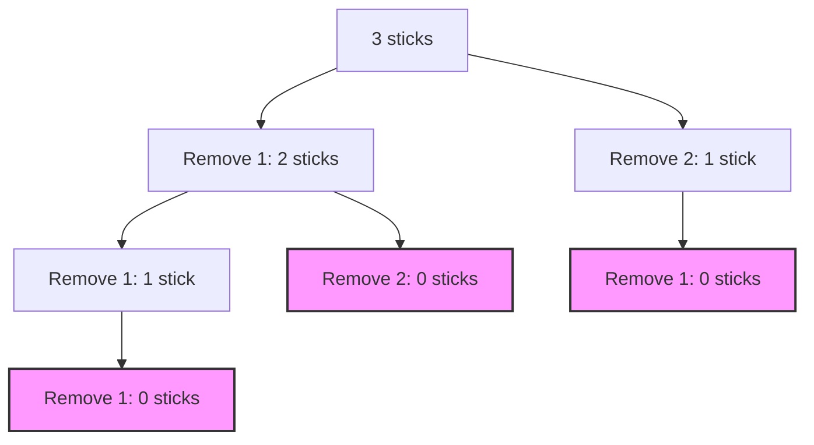
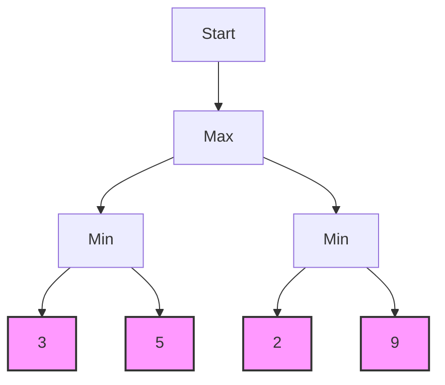

# Searching Techniques in Artificial Intelligence

---

## Introduction to Searching Techniques

- Searching techniques are methods used to find solutions to problems by exploring different possibilities. In Artificial Intelligence (AI), searching helps computers solve puzzles, play games, and make decisions by looking for the best way to reach a goal.
- Problem solving by searching means breaking a problem into smaller steps and checking each step to see if it leads to the solution.
- Searching for solutions is like finding a path from a starting point to a goal, checking different routes until the best one is found.

---

## Problem Solving by Searching

- In AI, many problems can be solved by searching through possible states or actions. The computer starts at an initial state and explores different paths to reach the goal state.
- Each step or move leads to a new state. The process continues until the goal is found or all possibilities are checked.
- Examples include solving puzzles, finding routes on a map, or playing games like chess.

---

## Searching for Solutions

- The process of searching for solutions involves:
  1. Defining the problem and goal.
  2. Listing possible actions or moves.
  3. Exploring different paths using a search algorithm.
  4. Checking if the goal is reached.
  5. Choosing the best solution found.
- Search algorithms help computers make decisions and find answers efficiently.

---

## Uninformed vs Informed Search & Heuristics

**PYQ Compare uninformed and informed search methods (2023, Section A)**

- **Uninformed Search (Blind Search):**

  - Does not use any extra information about the problem except the start and goal states.
  - Examples: Breadth-First Search (BFS), Depth-First Search (DFS).
  - Explores all possible paths equally, which can be slow and use lots of memory.

- **Informed Search (Heuristic Search):**
  - Uses extra information (heuristics) to guess which path is better.
  - Examples: Best-First Search, A\* Algorithm.
  - Faster and more efficient because it focuses on promising paths.

| Point               | Uninformed Search            | Informed Search                     |
| ------------------- | ---------------------------- | ----------------------------------- |
| 1. Knowledge Used   | No extra info (blind)        | Uses heuristics                     |
| 2. Examples         | BFS, DFS, Uniform Cost       | Best-First, A\*, Greedy             |
| 3. Efficiency       | Less efficient               | More efficient                      |
| 4. Memory Usage     | Can be high                  | Usually lower                       |
| 5. Path Explored    | All paths equally            | Promising paths first               |
| 6. Goal Detection   | May take longer              | Reaches goal faster                 |
| 7. Optimality       | BFS/Uniform Cost are optimal | A\* is optimal if heuristic is good |
| 8. Implementation   | Simple                       | More complex                        |
| 9. Domain Knowledge | Not required                 | Required                            |
| 10. Use Case        | Small/simple problems        | Large/complex problems              |

**PYQ Give the heuristic function for shortest path problem (2019, Section A)**

- **Heuristic Function:**
  - A heuristic is a simple rule or guess that helps a computer decide which step to take next when solving a problem.
  - It does not always give the exact answer, but it helps find the solution faster by pointing in the right direction.
  - For shortest path problems, a common heuristic is the straight-line distance (also called "as the crow flies") from where you are now to where you want to go.
  - **Example:** Imagine you are trying to find the shortest way from your house to your school on a map. The straight-line distance between your house and school is a good heuristic—it tells you how close you are, even if you can't walk in a straight line.
  - Computers use this idea to choose which path to try next. If one path gets you closer to the goal (school), the computer will try that path first.
  - Heuristics make searching faster and help computers solve puzzles, find routes, and play games more efficiently.

**PYQ Explain the A\* Algorithm with steps till goal state (2022, Section C)**

**A\* Algorithm: Complete Explanation with Steps and Example**

Below is a **complete, from-zero explanation of the A\* algorithm**, written in **very simple English**, as if you **know nothing at all**. This is **perfect for understanding + exams**.

---

# A\* Algorithm (A-Star Algorithm)

## 1️⃣ What is the A\* Algorithm?

The **A\*** algorithm is a **search algorithm** used in **Artificial Intelligence** to find the **best (shortest and cheapest) path** from a **start point** to a **goal point**.

👉 It is commonly used in:

- Path finding (maps, GPS)
- Games
- Robotics
- AI problem solving

---

## 2️⃣ Simple Idea of A\*

A\* works by:

- Looking at the **cost already spent**
- Estimating the **cost to reach the goal**
- Choosing the path with the **lowest total cost**

In simple words:

> **A\* chooses the smartest path, not just the shortest-looking one.**

---

## 3️⃣ Key Terms Used in A\*

### 1. g(n) – Cost so far

- Actual cost from **start → current node**

### 2. h(n) – Heuristic cost

- Estimated cost from **current node → goal**

### 3. f(n) – Total cost

[
f(n) = g(n) + h(n)
]

👉 A\* always selects the node with the **lowest f(n)**.

---

## 4️⃣ What is a Heuristic? (Very Simple)

A **heuristic** is a **guess** of how far the goal is.

Example:

- Straight-line distance in maps
- Manhattan distance in grids

👉 It helps A\* search **faster and smarter**.

---

## 5️⃣ Data Structures Used

### Open List

- Nodes to be explored

### Closed List

- Nodes already explored

---

## 6️⃣ Step-by-Step Working of A\*

1. Add the **start node** to the Open list.
2. Calculate **f(n)** for the start node.
3. Pick the node with **lowest f(n)** from Open list.
4. Move it to the Closed list.
5. Expand its neighboring nodes.
6. Calculate **g(n), h(n), f(n)** for each neighbor.
7. Add neighbors to Open list (if not already explored).
8. Repeat until:

   - Goal node is reached, or
   - Open list becomes empty.

---

## 7️⃣ Simple Example (Grid Path)

- Start = S
- Goal = G
- A\* checks nearby cells
- Calculates cost
- Moves step by step choosing lowest **f(n)**
- Reaches goal using best path

---

## 8️⃣ Why A\* is Better Than Other Search Algorithms

✔ Faster than BFS and DFS
✔ Finds optimal path
✔ Uses heuristics for smart search
✔ Complete and optimal (with correct heuristic)

---

## 9️⃣ Limitations of A\*

❌ Uses more memory
❌ Depends on quality of heuristic
❌ Slow if heuristic is poor

---

## 🔟 One-Paragraph Exam Answer

**A\* is an informed search algorithm that finds the optimal path by combining the actual cost from the start and the estimated cost to the goal. It uses a heuristic function to guide the search and selects the node with the minimum total cost value f(n).**

---

**PYQ Discuss constraint satisfaction search strategy via DFS, BFS, Best-first (2019, Section C)**

# BFS DFS Best First

Below is a **complete but easy explanation** of **BFS, DFS, and Best-First Search**, each with a **simple example**, written so you can **understand from zero** and also **write in exams**.

---

# 1️⃣ Breadth First Search (BFS)

## What is BFS?

**BFS** is a search algorithm that explores **all nodes level by level**.

👉 It first checks **nearest nodes**, then moves outward.

---

## How BFS Works (Simple)

- Uses a **Queue (FIFO)**
- Explores **all neighbors first**
- Guarantees **shortest path** (if all costs are equal)

---

## BFS Example

### Tree:

```
        A
      /   \
     B     C
    / \     \
   D   E     F
```

### BFS Traversal:

```
A → B → C → D → E → F
```

---

## Key Points of BFS

✔ Complete
✔ Finds shortest path
❌ Uses more memory

---

# 2️⃣ Depth First Search (DFS)

## What is DFS?

**DFS** goes **deep into one path** before checking other paths.

👉 It explores **as far as possible** along one branch.

---

## How DFS Works (Simple)

- Uses a **Stack (LIFO)** or recursion
- Goes **deep first**, then backtracks
- Does **not guarantee shortest path**

---

## DFS Example

### Same Tree:

```
        A
      /   \
     B     C
    / \     \
   D   E     F
```

### DFS Traversal:

```
A → B → D → E → C → F
```

---

## Key Points of DFS

✔ Uses less memory
✔ Simple
❌ May get stuck in deep path

---

# 3️⃣ Best First Search (Greedy Best-First Search)

## What is Best First Search?

Best First Search selects the node that **looks closest to the goal** using a **heuristic**.

👉 It chooses the **most promising node** first.

---

## How Best First Works (Simple)

- Uses **Priority Queue**
- Uses only **heuristic h(n)**
- Ignores cost so far

---

## Best First Search Example

Assume goal is **G** and heuristic values:

| Node | h(n) |
| ---- | ---- |
| A    | 6    |
| B    | 4    |
| C    | 2    |
| D    | 3    |
| G    | 0    |

### Traversal:

```
A → C → G
```

(Chooses smallest h(n) every time)

---

## Key Points of Best First Search

✔ Fast
✔ Goal-directed
❌ Not optimal
❌ Can be misleading

---

# 🔁 Comparison Table (Exam Gold)

| Feature             | BFS        | DFS        | Best First     |
| ------------------- | ---------- | ---------- | -------------- |
| Search type         | Uninformed | Uninformed | Informed       |
| Data structure      | Queue      | Stack      | Priority Queue |
| Uses heuristic      | ❌ No      | ❌ No      | ✅ Yes         |
| Finds shortest path | ✅ Yes     | ❌ No      | ❌ No          |
| Memory usage        | High       | Low        | Medium         |

# Adversarial Search Methods & Game Search

**Explain Searching techniques used in games (2024, Section B)**
**Briefly explain adversarial search (2023, Section A)**

- **Adversarial Search:**

  - Adversarial search is used in games where two players compete, like chess or tic-tac-toe. The goal is to find the best move by considering the opponent's possible responses.
  - The search tree represents all possible moves for both players. Each level alternates between the player's move and the opponent's move.

## Minimax Algorithm in Game Search (Nim Game Example)

**Apply the minimax algorithm to the search tree for nim game (2019, Section B)**
**Discuss Min-Max search algorithm with diagram (2023, Section C)**


### What is Minimax?

- Minimax is a decision-making algorithm used in two-player games like chess, tic-tac-toe, and nim.
- It helps a player choose the best move by assuming both players play their best.
- The goal is to maximize your minimum gain (best worst-case scenario).

### How Minimax Works

1. **Build the Game Tree:**  
   Draw all possible moves for both players, starting from the current position.
2. **Assign Values to End States:**  
   At the bottom (leaves) of the tree, mark win (+1), lose (-1), or draw (0).
3. **Backtrack and Choose Best Moves:**  
   Starting from the leaves, work up the tree:
   - If it's your turn, pick the move with the highest value.
   - If it's the opponent's turn, pick the move with the lowest value.

### Example: Nim Game

Suppose you have 3 sticks. Players take turns removing 1 or 2 sticks. The player who takes the last stick wins.

#### Game Tree Diagram


```mermaid
graph TD
     S3[3 sticks] --> S2a[Remove 1: 2 sticks]
     S3 --> S1a[Remove 2: 1 stick]
     S2a --> S1b[Remove 1: 1 stick]
     S2a --> S0a[Remove 2: 0 sticks]
     S1a --> S0b[Remove 1: 0 sticks]
     S1b --> S0c[Remove 1: 0 sticks]
     style S0a fill:#f9f,stroke:#333,stroke-width:2px
     style S0b fill:#f9f,stroke:#333,stroke-width:2px
     style S0c fill:#f9f,stroke:#333,stroke-width:2px
```

#### Assign Values

- If you reach 0 sticks on your turn, you win (+1).
- If the opponent reaches 0 sticks, you lose (-1).

#### Step-by-Step Minimax

1. **Leaf Nodes:**
   - S0a, S0b, S0c: Win (+1) or Lose (-1) depending on whose turn it is.
2. **Backtrack:**
   - For each parent node, choose the best value:
     - If it's your turn, pick the move with the highest value.
     - If it's the opponent's turn, pick the lowest value.

#### Table Example

| State    | Your Move | Opponent Move | Outcome |
| -------- | --------- | ------------- | ------- |
| 3 sticks | Remove 1  | Remove 1/2    | ?       |
| 3 sticks | Remove 2  | Remove 1      | ?       |
| 2 sticks | Remove 1  | Remove 1      | ?       |
| 2 sticks | Remove 2  | Win           | +1      |
| 1 stick  | Remove 1  | Win           | +1      |

### Key Points

- Minimax explores all possible moves and outcomes.
- It helps you avoid moves that could let your opponent win.
- The algorithm is slow for big games but works well for small ones like nim.

### Simple Explanation

- Imagine you and your friend play a game.
- You look ahead at all possible moves.
- You pick the move that gives you the best chance to win, even if your friend tries their best to beat you.

### Summary Table

| Step         | What Happens                       |
| ------------ | ---------------------------------- |
| Build Tree   | Draw all possible moves            |
| Assign Value | Mark win (+1), lose (-1), draw (0) |
| Backtrack    | Choose best move at each level     |
| Decide Move  | Pick move with highest value       |

---

### Minimax Algorithm Diagram

```mermaid
graph TD
     A[Your Turn] --> B[Opponent Turn]
     B --> C[Your Turn]
     C --> D[Win (+1)]
     C --> E[Lose (-1)]
     B --> F[Your Turn]
     F --> G[Win (+1)]
     F --> H[Lose (-1)]
```

- At each level, minimax chooses the best move for you and the worst for your opponent.

---

## Alpha-Beta Pruning and Minimax Improvements


**PYQ**

- **Describe _alpha-beta pruning_ and other Min-Max improvements (2022, Section B)**
- **Explain _Alpha-Beta pruning_ with example (2024, Section C)**
- **Explain the concept of the Alpha - bata testing pruning and write the alpha beta test algorith (2018, Section C)**

### 1. What is Alpha-Beta Pruning?

- **Definition:**  
   Alpha-beta pruning is a technique used to speed up the minimax algorithm in two-player games (like chess, tic-tac-toe, nim). It "prunes" (cuts off) branches in the game tree that cannot possibly affect the final decision, so the computer doesn't waste time checking moves that won't matter.

### 2. Why Use Alpha-Beta Pruning?

- **Minimax Problem:**  
   Minimax checks every possible move for both players, which can be very slow for big games.
- **Alpha-Beta Solution:**  
   Alpha-beta pruning skips parts of the tree that are not needed, making the search much faster and allowing deeper lookahead.

### 3. How Does Alpha-Beta Pruning Work?

- **Alpha:**  
   The best value that the maximizer (you) can guarantee so far.
- **Beta:**  
   The best value that the minimizer (opponent) can guarantee so far.
- **Pruning Rule:**  
   If the current branch can't improve the outcome for either player, stop exploring it.

#### **Step-by-Step Algorithm**

1. Start with alpha = $-\infty$, beta = $+\infty$.
2. Traverse the game tree like minimax.
3. At each node:
   - If it's your turn (maximizer), update alpha.
   - If it's opponent's turn (minimizer), update beta.
4. If alpha $\geq$ beta at any point, prune (stop searching) that branch.
5. Continue until all relevant branches are checked.

### 4. Alpha-Beta Pruning Example

Suppose you have a simple game tree:


```mermaid
graph TD
        A[Start] --> B[Max]
        B --> C1[Min]
        B --> C2[Min]
        C1 --> D1[3]
        C1 --> D2[5]
        C2 --> D3[2]
        C2 --> D4[9]
        style D1 fill:#f9f,stroke:#333,stroke-width:2px
        style D2 fill:#f9f,stroke:#333,stroke-width:2px
        style D3 fill:#f9f,stroke:#333,stroke-width:2px
        style D4 fill:#f9f,stroke:#333,stroke-width:2px
```

- As you evaluate nodes, if you find a value that is worse than what you already have, you stop checking further (prune).

#### **Simple Table Example**

| Node | Alpha | Beta | Prune? |
| ---- | ----- | ---- | ------ |
| D1   | 3     | ∞    | No     |
| D2   | 5     | ∞    | No     |
| D3   | 2     | 5    | Yes    |
| D4   | 9     | 5    | Yes    |

### 5. Benefits of Alpha-Beta Pruning

- **Faster:**  
   Reduces the number of nodes checked, so the computer can look further ahead in the same amount of time.
- **Same Result:**  
   Finds the same best move as minimax, just quicker.
- **Used in Games:**  
   Essential for computer chess, tic-tac-toe, and other strategy games.

### 6. Other Minimax Improvements

- **Move Ordering:**  
   Try best moves first to maximize pruning.
- **Transposition Tables:**  
   Remember already checked positions to avoid repeating work.
- **Iterative Deepening:**  
   Search deeper step by step, useful for time-limited searches.

### 10. Diagram: Alpha-Beta Pruning in Action


```mermaid
graph TD
        S[Start] --> M1[Max]
        M1 --> N1[Min]
        M1 --> N2[Min]
        N1 --> L1[3]
        N1 --> L2[5]
        N2 --> L3[2]
        N2 --> L4[9]
        style L1 fill:#f9f,stroke:#333,stroke-width:2px
        style L2 fill:#f9f,stroke:#333,stroke-width:2px
        style L3 fill:#f9f,stroke:#333,stroke-width:2px
        style L4 fill:#f9f,stroke:#333,stroke-width:2px
        %% Pruned branches can be shown with dashed lines or notes
```

---

### 11. In Simple English (Grade 8 Level)

- Alpha-beta pruning helps computers play games faster by skipping moves that don't matter.
- It works with minimax to find the best move, but doesn't waste time on bad choices.
- Used in chess, tic-tac-toe, and other games where you and your opponent take turns.

---

# PYQ's

## **Grouped Questions by Topic**

### **Uninformed vs Informed Search**

- Compare _uninformed and informed search methods_ (2023, Section A)
- Give the heuristic function for shortest path problem (2019, Section A)
- Discuss _water jug problem with heuristic search techniques_ (2024, Section C)
- Explain the _A_ Algorithm\* with steps till goal state (2022, Section C)

### **Local Search (Hill Climbing)**

- What do you infer from _hill-climbing search algorithm_? (2019, Section A)
- Differentiate between _simple hill climbing_ and _steepest ascent hill climbing_ (2022, Section A)
- Explain Steepest-ascent climbing algo... and discuss problems with it (2018, Section B)

### **Global Search**

- Diff between Local Search and Global Search (2018, Section A)

### **Adversarial Search (Min-Max, Alpha-Beta, Games)**

- Apply the _minimax algorithm_ to the search tree for nim game (2019, Section B)
- Discuss _Min-Max search algorithm_ with diagram (2023, Section C)
- Describe _alpha-beta pruning_ and other Min-Max improvements (2022, Section B)
- Explain _Alpha-Beta pruning_ with example (2024, Section C)
- Explain the concept of the Alpha - bata testing pruning and write the alpha beta test algorith (2018, Section C)
- Explain _Searching techniques used in games_ (2024, Section B)
- Briefly explain _adversarial search_ (2023, Section A)

### **General Search Algorithms**

- Implement the _Search Algorithms_ in LISP/C. Comment suitability (2019, Section C)
- Discuss use of _PROLOG_ for search algorithms (2019, Section C)
- Discuss branch bound search algo (2018, Section A)
- Discuss constraint satisfaction search strategy via DFS, BFS, Best-first (2019, Section C)
- Explain _Best-first search algorithm_ with diagram (2023, Section B)
- Discuss _searching process_ (2024, Section A)

### **AND-OR Graphs**

- Explain _AND-OR graph searching algorithm_ (2023, Section C)

### **Simulated Annealing**

- Discuss Simulated Annealing seach algorthm with its advantages and disadvantages (2018, Section C)

### **State Space Search**

- Explain _forward and backward state space search_ (2019, Section C)

---

✅ **Summary of Coverage:**

- **Uninformed Search** → 2023 (Section A – compare uninformed vs informed).
- \*_Informed Search (Heuristic, A_)\*\* → 2019 (heuristic), 2022 (A\*), 2024 (heuristic search water jug).
- **Local Search (Hill Climbing)** → 2019 (hill climbing), 2022 (simple vs steepest hill climbing).
- **Adversarial Search (Min-Max, Alpha-Beta)** → 2019 (nim game minimax), 2022 (alpha-beta), 2023 (min-max), 2024 (alpha-beta).
- **Search in Games** → 2019 (minimax nim), 2024 (games search).
- **AND-OR Graphs** → 2023 (Section C).
- **General Search Algorithms** → 2019 (implementations), 2023 (best-first), 2024 (search process).
